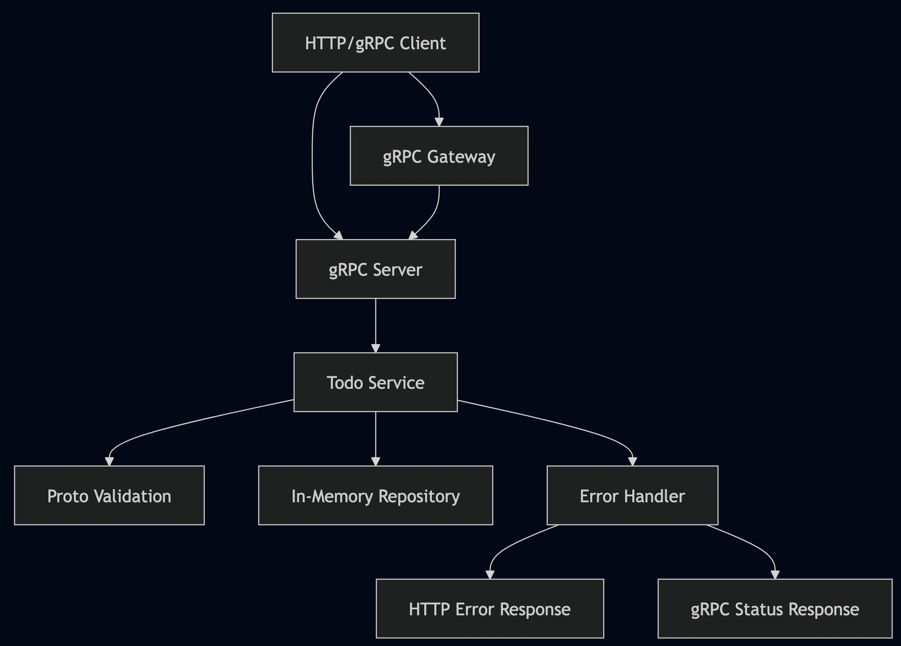

# TODO API with Advanced Error Handling & AI-Powered Proto Analysis

[](https://golang.org)
[](https://grpc-ecosystem.github.io/grpc-gateway/)
[](https://developers.google.com/protocol-buffers)
[](https://tools.ietf.org/html/rfc7807)
[](https://langchain.com)
[](https://cloud.google.com/vertex-ai)

A comprehensive demonstration of **professional error handling** in Go microservices using gRPC and HTTP APIs, enhanced with **AI-powered Protocol Buffer analysis tools** for API breaking change detection and PII data leak prevention. This project showcases best practices for structured error responses, validation, and includes advanced LangChain/LangGraph/Vertex AI integrations for automated API governance.

## 🚀 Features

### Core API Features
- **🔧 Dual Protocol Support**: gRPC and HTTP/REST APIs with unified error handling
- **📋 RFC 7807 Compliance**: HTTP responses follow Problem Details standard
- **🛡️ Robust Validation**: Proto-based validation with detailed field-level errors
- **📊 Structured Errors**: Machine-readable error codes and human-friendly messages
- **🔍 Tracing Integration**: Request correlation with trace IDs
- **📈 Metrics & Monitoring**: Prometheus metrics for error tracking
- **🔄 Retry Guidance**: Client-friendly retry information for transient errors
- **🎯 Type Safety**: Protobuf-defined error structures

### AI-Powered Proto Analysis Tools
- **🚨 API Breaking Change Detection** (`check-api-break-automation/`):
  - Automatically detects breaking changes in Protocol Buffer definitions
  - Uses LangChain/LangGraph with Vertex AI for intelligent analysis
  - Supports RAG (Retrieval-Augmented Generation) for context-aware detection
  - MCP (Model Context Protocol) server integration for enhanced analysis
  - 95%+ accuracy in identifying breaking changes

- **🔐 PII Data Leak Prevention** (`check-pii-automation/`):
  - Automatically detects PII (Personally Identifiable Information) in proto definitions
  - Classifies sensitivity levels (HIGH, MEDIUM, LOW, PUBLIC)
  - Generates appropriate proto annotations for data protection
  - 92%+ accuracy in PII field detection and classification
  - Supports batch processing and CI/CD integration

## 🏗️ Architecture Overview



## 📋 Prerequisites

### For Core API
- **Go 1.24+**
- **Protocol Buffers Compiler** (`protoc`)
- **Buf CLI** (recommended for proto management)

### For AI-Powered Tools
- **Python 3.8+**
- **Google Cloud Project** with Vertex AI API enabled
- **LangChain & LangGraph** (installed via requirements.txt)
- **Vertex AI credentials** (via gcloud auth or service account)

## 🛠️ Quick Start

### 1. Clone and Setup

```bash
git clone https://github.com/bhatti/todo-api-errors.git
cd todo-api-errors

# Install dependencies
go mod tidy

# Generate protobuf code
make buf-generate

# Build the application
make build
```

### 2. Run the Server

```bash
# Start all services (gRPC, HTTP Gateway, Metrics)
./server

# Or using make
make run
```

**Services will be available at:**
- 🌐 **HTTP API**: `http://localhost:8080`
- 🔌 **gRPC API**: `localhost:50051`
- 📊 **Metrics**: `http://localhost:9090/metrics`

### 3. Test the API

```bash
# Run the included test client
go run client.go

# Or test manually with curl
curl -X POST http://localhost:8080/v1/tasks \
  -H "Content-Type: application/json" \
  -H "X-Trace-ID: test-123" \
  -d '{
    "task": {
      "title": "Learn gRPC Error Handling",
      "description": "Master professional error responses",
      "priority": "PRIORITY_HIGH"
    }
  }'
```

## 📚 API Documentation

### Endpoints

| Method | Endpoint | Description |
|--------|----------|-------------|
| `POST` | `/v1/tasks` | Create a new task |
| `GET` | `/v1/tasks/{id}` | Get a specific task |
| `GET` | `/v1/tasks` | List all tasks |
| `PATCH` | `/v1/tasks/{id}` | Update a task |
| `DELETE` | `/v1/tasks/{id}` | Delete a task |
| `POST` | `/v1/tasks:batchCreate` | Create multiple tasks |

### Example Requests

<details>
<summary><strong>Create Task</strong></summary>

```bash
curl -X POST http://localhost:8080/v1/tasks \
  -H "Content-Type: application/json" \
  -d '{
    "task": {
      "title": "Complete project documentation",
      "description": "Write comprehensive README and API docs",
      "priority": "PRIORITY_HIGH",
      "due_date": "2025-12-31T23:59:59Z",
      "tags": ["documentation", "project"]
    }
  }'
```

**Success Response (201):**
```json
{
  "name": "tasks/550e8400-e29b-41d4-a716-446655440000",
  "title": "Complete project documentation",
  "description": "Write comprehensive README and API docs",
  "status": "STATUS_PENDING",
  "priority": "PRIORITY_HIGH",
  "due_date": "2025-12-31T23:59:59Z",
  "create_time": "2025-08-15T10:30:00Z",
  "update_time": "2025-08-15T10:30:00Z",
  "created_by": "anonymous",
  "tags": ["documentation", "project"]
}
```
</details>

<details>
<summary><strong>List Tasks</strong></summary>

```bash
curl "http://localhost:8080/v1/tasks?page_size=10&filter=status=STATUS_PENDING"
```

**Success Response (200):**
```json
{
  "tasks": [...],
  "next_page_token": "next_token_here",
  "total_size": 42
}
```
</details>

## 🚨 Error Handling Examples

This project demonstrates various error scenarios with professional, client-friendly responses.

### Validation Errors (422)

**Request:**
```bash
curl -X POST http://localhost:8080/v1/tasks \
  -H "Content-Type: application/json" \
  -d '{
    "task": {
      "title": "",
      "description": "This description is way too long and exceeds the maximum allowed length for task descriptions in our system",
      "tags": ["INVALID TAG", "valid-tag", "valid-tag"]
    }
  }'
```

**Response:**
```json
{
  "type": "https://api.example.com/errors/validation-failed",
  "title": "Validation Failed",
  "status": 422,
  "detail": "The request contains 3 validation errors",
  "instance": "/v1/tasks",
  "traceId": "abc123def456",
  "timestamp": "2025-08-15T10:30:00Z",
  "errors": [
    {
      "field": "title",
      "code": "REQUIRED_FIELD",
      "message": "Task title is required"
    },
    {
      "field": "description", 
      "code": "TOO_LONG",
      "message": "Description exceeds maximum length of 100 characters"
    },
    {
      "field": "tags[0]",
      "code": "INVALID_TAG_FORMAT",
      "message": "Tag 'INVALID TAG' must be lowercase letters, numbers, and hyphens only"
    }
  ]
}
```

### Resource Not Found (404)

**Request:**
```bash
curl http://localhost:8080/v1/tasks/non-existent-id
```

**Response:**
```json
{
  "type": "https://api.example.com/errors/resource-not-found",
  "title": "Resource Not Found",
  "status": 404,
  "detail": "Task with ID 'non-existent-id' was not found.",
  "instance": "/v1/tasks/non-existent-id",
  "traceId": "xyz789abc123",
  "timestamp": "2025-08-15T10:30:00Z"
}
```

### Resource Conflict (409)

**Request:** (Creating duplicate task)
```bash
# Create first task
curl -X POST http://localhost:8080/v1/tasks \
  -H "Content-Type: application/json" \
  -d '{"task": {"title": "Unique Task Title"}}'

# Try to create duplicate
curl -X POST http://localhost:8080/v1/tasks \
  -H "Content-Type: application/json" \
  -d '{"task": {"title": "Unique Task Title"}}'
```

**Response:**
```json
{
  "type": "https://api.example.com/errors/resource-conflict",
  "title": "Resource Conflict", 
  "status": 409,
  "detail": "Conflict creating task: A task with this title already exists",
  "instance": "/v1/tasks",
  "traceId": "conflict123",
  "timestamp": "2025-08-15T10:30:00Z"
}
```

### Service Unavailable (503)

**Response:**
```json
{
  "type": "https://api.example.com/errors/service-unavailable",
  "title": "Service Unavailable",
  "status": 503,
  "detail": "Database connection pool exhausted. Please try again later.",
  "instance": "/v1/tasks",
  "traceId": "service503",
  "timestamp": "2025-08-15T10:30:00Z",
  "extensions": {
    "retryable": true,
    "retryAfter": "2025-08-15T10:30:30Z",
    "maxRetries": 3,
    "backoffType": "exponential",
    "backoffMs": 1000
  }
}
```

### Batch Operations with Partial Failures

**Request:**
```bash
curl -X POST http://localhost:8080/v1/tasks:batchCreate \
  -H "Content-Type: application/json" \
  -d '{
    "requests": [
      {"task": {"title": "Valid Task 1"}},
      {"task": {"title": ""}},
      {"task": {"title": "Valid Task 2"}},
      {"task": null}
    ]
  }'
```

**Response:** Shows partial success with detailed error information.


## 🤖 AI-Powered Proto Analysis Tools

### API Breaking Change Detection

The `check-api-break-automation/` directory contains an advanced tool that uses AI to detect breaking changes in Protocol Buffer definitions.

**Key Features:**
- Detects field removals, type changes, and other breaking modifications
- Uses LangChain with Vertex AI (Gemini) for intelligent analysis
- RAG integration for learning from proto documentation
- MCP server support for enhanced context
- Generates detailed reports with recommendations

**Quick Start:**
```bash
cd check-api-break-automation
python -m venv venv
source venv/bin/activate
pip install -r requirements.txt

# Detect breaking changes
python detect_breaking_changes.py \
  ../api/proto/todo/v1/todo.proto \
  --baseline HEAD~1
```

[Full Documentation →](check-api-break-automation/README.md)

### PII Data Leak Prevention

The `check-pii-automation/` directory contains an AI-powered tool for detecting and classifying PII in Protocol Buffer definitions.

**Key Features:**
- Identifies 20+ types of PII (SSN, credit cards, medical records, etc.)
- Classifies sensitivity: HIGH, MEDIUM, LOW, PUBLIC
- Generates proto annotations automatically
- 92%+ accuracy in field classification
- Supports CI/CD integration

**Quick Start:**
```bash
cd check-pii-automation
python -m venv venv
source venv/bin/activate
pip install -r requirements.txt

# Detect PII in proto files
python pii_detector.py \
  ../api/proto/pii/v1/account_without_annotations.proto \
  --output output/annotated.proto \
  --json output/report.json
```

[Full Documentation →](check-pii-automation/README.md)

### CI/CD Integration

Both tools can be integrated into your CI/CD pipeline:

```yaml
# GitHub Actions example
- name: Check API Breaking Changes
  run: |
    python check-api-break-automation/detect_breaking_changes.py \
      api/proto/**/*.proto --baseline main

- name: Detect PII Leaks
  run: |
    python check-pii-automation/pii_detector.py \
      api/proto/**/*.proto --json pii_report.json
```

## 📖 Best Practices Demonstrated

### Error Handling
- **📏 Consistent Error Format**: RFC 7807 for HTTP, structured gRPC status
- **🎯 Granular Error Codes**: Machine-readable application-specific codes
- **🔍 Request Tracing**: Every error includes correlation IDs
- **💬 Human-Friendly Messages**: Clear, actionable error descriptions
- **🔄 Retry Guidance**: Clients know when and how to retry
- **📊 Observability**: Comprehensive metrics and logging
- **🛡️ Type Safety**: Protobuf-defined error structures
- **🧪 Testability**: Comprehensive error scenario coverage

### API Governance with AI
- **🔒 Automated PII Detection**: Prevent data leaks before deployment
- **⚡ Breaking Change Prevention**: Catch API compatibility issues early
- **📝 Proto Annotation Generation**: Automatic sensitivity classifications
- **🎯 High Accuracy**: AI models achieve 90%+ accuracy
- **🔄 CI/CD Ready**: Seamless integration with existing pipelines


## 📄 License

This project is licensed under the MIT License - see the [LICENSE](LICENSE) file for details.

